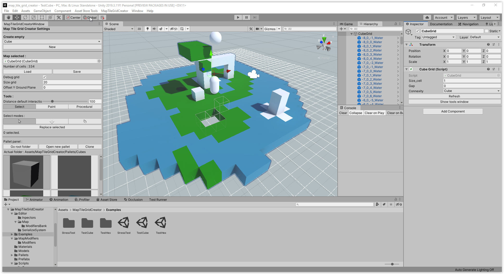
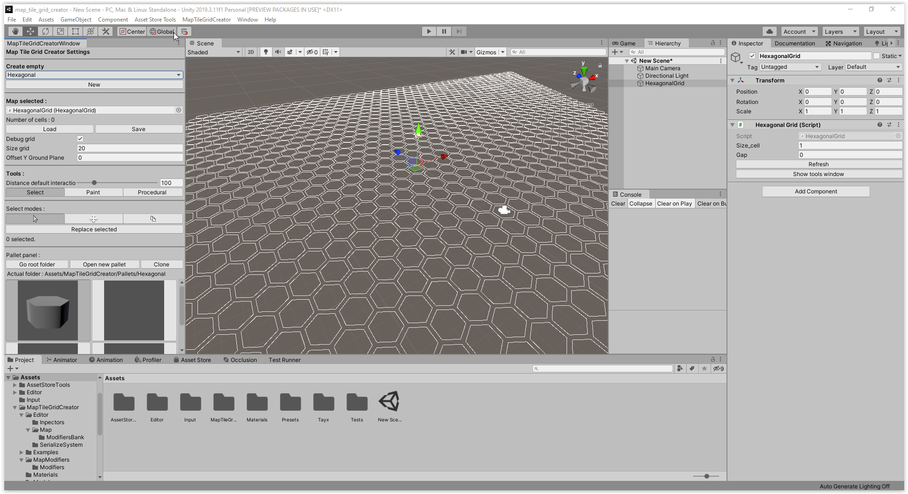

# Installation

Import the custom package like other in Unity.
When it's done you have a new folder MapTileGridCreator with all the script and asset needed. To see the list of files see [Hierarchy](./4.Hierarchy.md).

There isn't special dependencies of Unity Package even if in the PlayerGridMovement Script you could find commented code for the new input system.

You can than open one of the examples project to understand and try it immediatly. 

# Quick use 

Click on the onglet **MapTileGridCreator > Open** to have a new windows in order to create and modify the 3d map grid. You will have this :

Select the type of grid you want and then you click on the **New** button in order to create a new map.

A debug grid must appear and then you can begin to create and use the different tools.
An extra step could be to change the default cube's pallet prefab to an another with the button **Open new pallet**. Select the folder that contains the prefabs you want.

You can add more prefab in addition of the default ones, and don't hesitate to see the tutorial [Editor](./Editor.md) for the detailed explanation of all features.