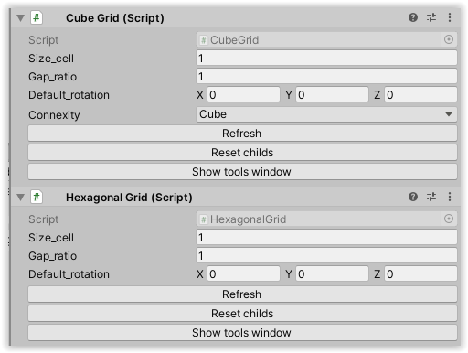

# Grid

There is two types of Grid3D Components, the hexagonal and the cube one.

These two permit to change the size of the cell and the gap beetween, also the defaul rotation for childs especially if you want to adjust the prefabs to the apropriate size and rotation. 

They also have a **Refresh** button for refreshing the grid if modifications have been done, and to verify the good implementions of cell in children, like no duplicate have been made ouside of the MapTileGridCreator editor functionnalities.

**Reset childs** reset the transform of all the childs. Don't use it if you have done some manual modification for special element transform.

The **Show tools window** display the editor window for modify them. It's unrecommended to modify directly cells in the grid and can conduct to unpredictable behaviour, use the editor instead.

The cube have also a special field **Connexity** in order to have considered in cell's neibhours the diagonals or not.

# Cell

The cell permit to debug the index of the grid it have. Modify it directly could lead to superposed cell so be carefull with it. For reading, by convention use the Unity's one for **right**, **up**, **forward** directions corresponding to XYZ, but the XYZ axes of grid correspond to Unity only in the cube implementation.

 See the code for more informations about oher components, implementation of Grid3D and index handling.