# General

When you open first the window editor with the onglet **MapTileGridCreator > Open**, you will see two sections, **Create empty** and **Map selected**. If a grid alrerady exist, you can click on the inpector **Show tools window** button.

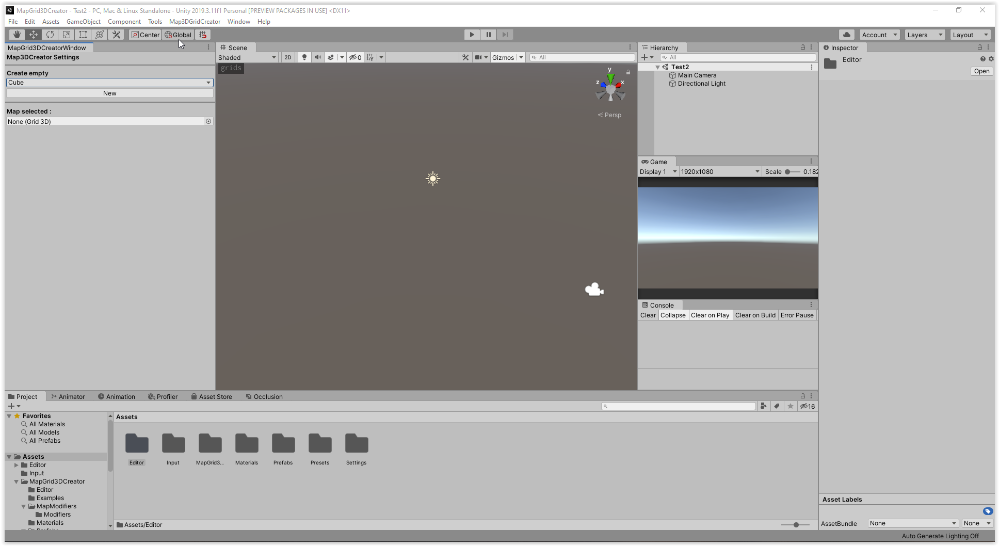

They are pretty transparent and permit to create or select the grid you want. 

You can also click from on a cell or grid GameObject to make appear the third section, "Tools" and more options. 

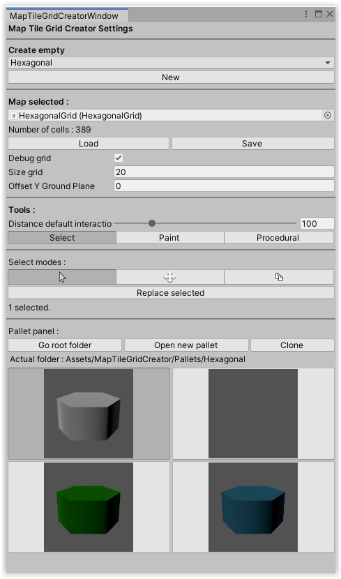

Like you can see you can **Load** or **Save** a map you have created in a JSON file. It permit to save or change manually some datas if you want. There is a debug recap on the console.

You can also debug the grid you have selected, and modify the **Size grid** of debug or the **Offset Y Ground plane** position. This debug grid also help to visualize some options in the tools. But it can take some resources to display with big size so desactivate it if not needed.

All the tools and operations explained have the features of **Undo/Redo** and are praticcally immediate (with the exception of procedural in general), but on large operations like moving 100 of cells, or procedural modification of 1 000 of cells etc, it could lead to drop in performance or some failure to register the action, so please save your progress before those.

# Panel pallette

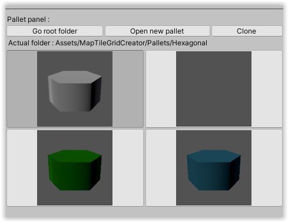

The pannel pallet appears when needed in different sections.
It permit to handle and preview a pallet of prefabs, based on a folder system for regrouping them. 
 
You can change the prefab selected by clicking on the different icons preview.

You can easily go in the folder containing the actual pallet with the associated button **Go root folder** . The button permit to select it in the project editor if you want to modify, add or delete prefabs.

**Open a new pallet** permit to change the actual pallet by selectionning the folder you want.

The last button **Clone** permit to make a copy of the actual pallet to an another folder.

# Select

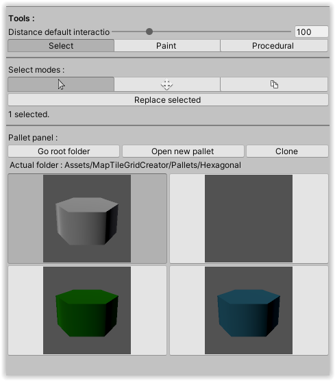

 The default mode is to select GameObject on the scene like you would do normally if you are not working with the editor. If cells are selected, it permit to replace them with the prefab selected with the button "Replace selected".

The next mode is the **Move** one. When you have selected cells in the previous tool, you can then move them like copy cut/paste to an other destination. 

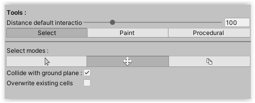

Right-click or go back change the mode in editor to cancel it.

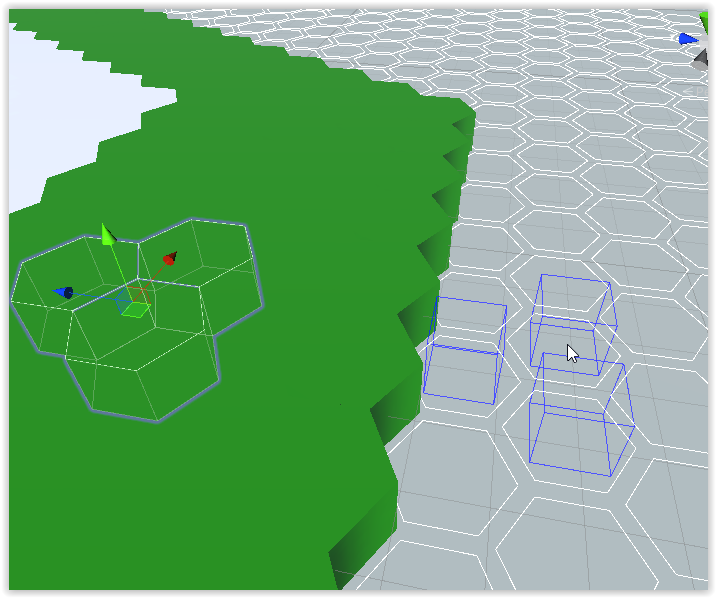

The **Stamp** mode have nearly the same behaviour, but it copy and paste selected components. An other option for this one permit to create pattern with a intermediate prefab. When you have selected interesting cells for a pattern, you can **Save to prefab** the selection and later use it with **Load from prefab**.

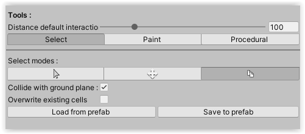

The option **Collide with ground plane** permit with the debugging grid to manipulate the height desired of placement. If it's not colliding with the plane or then with a other cell, it use the **Distance defaul interaction** value from the camera to place it.

The option **overwrite existing cells** like his name overwrite if some cells are superposed to existing cells.

# Paint

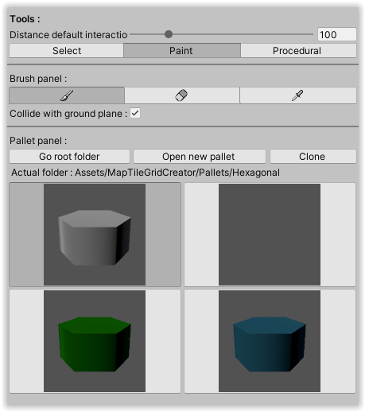

The paint tool is inpired from conventionnal graphic applications and have three modes :
- **Single**, permit to paint the prefab selected to the grid.
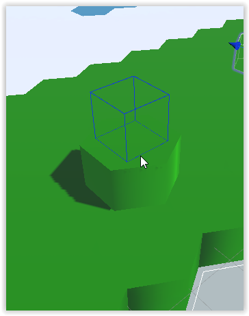
- **Erase**, like his name erase the cells on scene view. Right click to go back to Single.
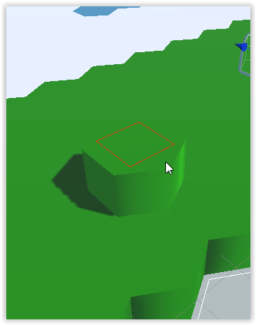
- **Eyedropper**, permit to select a prefab from one instance in the scene view. Right click to cancel.
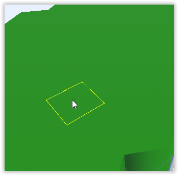

The options of those work identically as the **Select** tool ones. 

# Procedural

The last tool permit to handle procedural modifications.

To use it, you must create a **MapModifier** and the **Modifiers** associated in order to registrate different modifiers that will be applied sequentially. 

Right-click in the project editor and **Create > MapTileGridCreator > Modifiers> HeightRandom** for example.

There is only three **Modifier** for the moment, but all worked as the same.

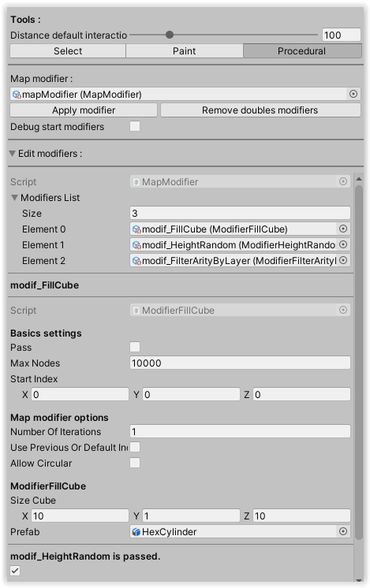

They have all the **Basic settings** with the option to:
- **Pass** the modifier.
- **Max Nodes** for the maximal number of cells it will compute.
- **Start Index** of the modifier that can be debug in the scene view (**Debug start modifiers** toggle under **Apply modifiers**).

Then the **Map modifier options** that permit to control the grid iteration:
- **Number of iteration** if you want to apply this modifier multiples times.
- **Use previous Or Default Index** to use the precedent index in the iteration. If it's the first modifier, it use by default the (0,0,0) index.
You can combine the two precedent for complex modifiers that need multiple pass.
- **Allow circular** that is ***DANGEROUS*** and must be used only when you have  read and understand the code documentation about it. It can conduct to infinite loops if the modifier don't explicitly handle circular iterations.

And we finih with the proper options of each modifier. For exemple here it fill a solid cubic form(in cube grid) centered to the start index and of the size (10,1,10). It use the prefab HexCylinder.